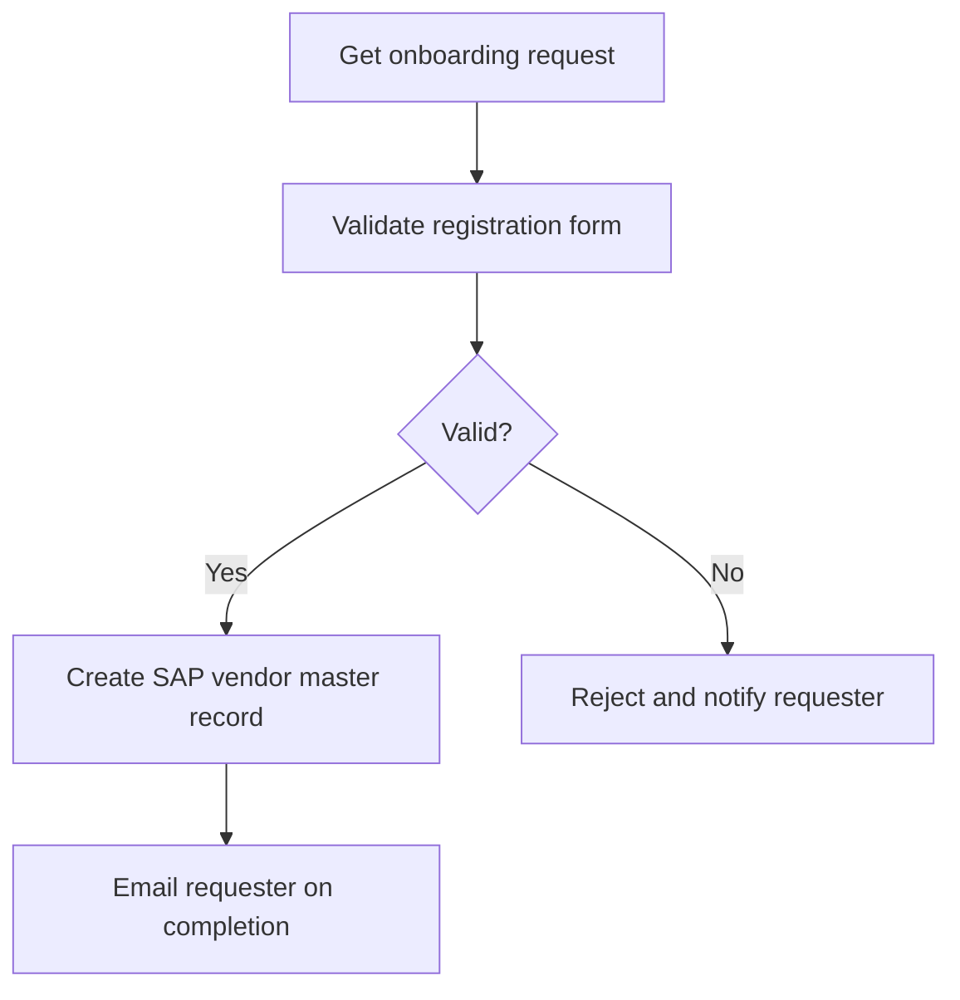

<!-- planner-handoff:v1 -->
## Planner Handoff
| Field | Value |
|---|---|
| Process name | Vendor Onboarding |
| Delivery model | cloud |
| Execution autonomy | autonomous |
| Solution scope | single-project |

# Solution Design Document: Vendor Onboarding

## 1. Process Overview
- **Process Name:** Vendor Onboarding
- **Objective:** Automate vendor onboarding by validating supplier registration
  forms and creating vendor master records in SAP.
- **In Scope:** validate registration forms, create SAP vendor master records,
  email the requester on completion.
- **Out of Scope:** contract negotiation, credit checks.

## 2. Process Map

## 5. Data Definitions
| Field | Type | Source |
|---|---|---|
| SupplierName | String | Registration form |
| TaxId | String | Registration form |
| BankDetails | String | Registration form |

## 11. Project Structure
- `Main.xaml` — orchestrates the onboarding run
- `ValidateForm.xaml` — registration-form validation
- `CreateVendor.xaml` — SAP vendor master creation

## 12. Queue Architecture
- **Queue name:** `VendorOnboardingQueue`
- One queue item per onboarding request; retried up to 2 times.

## 14. Packages
| Package | Purpose |
|---|---|
| UiPath.Excel.Activities | Read the registration workbook |
| UiPath.SAP.BAPI.Activities | Create the vendor master record |
| UiPath.Mail.Activities | Notify the requester |

## 16. Deployment Environment
| Field | Value |
|---|---|
| Robot type | Unattended |
| Orchestrator | Cloud |
| UiPath / Studio version | [SME REVIEW] |
| Dev environment | [SME REVIEW] |
| Source repository | [SME REVIEW] |
| Trigger | Time trigger, daily 07:00 |
| Scalable | Yes |

## 17. Testing Strategy
- Unit test each workflow with UiPath.Testing.Activities.
- Verify SAP record creation against a known-good fixture.
